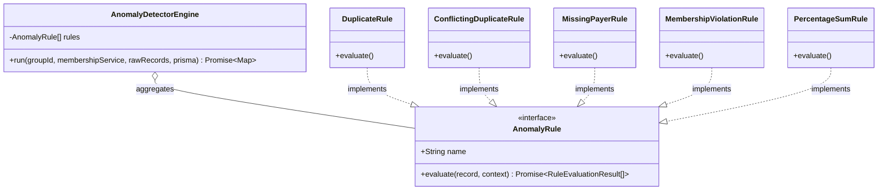

# Anomaly Rules Plugin Architecture

This document describes the extensible plugin-based architecture designed to detect data quality issues and structural anomalies in imported CSV transactions.

---

## Design Philosophy

The SettleUp Import Engine adheres to the **Open/Closed Principle (OCP)**. Instead of using a monolithic detection class containing giant nested conditional blocks, the rules are isolated into separate class modules that implement a unified contract interface.

Adding a new anomaly detection rule (e.g. check for extreme expense amounts) requires writing a new class implementing the `AnomalyRule` interface and registering it with the `AnomalyDetectorEngine`, with zero risk of breaking existing tested rules.

---

## Architecture Diagram



---

## Contract Interfaces

### 1. `AnomalyRule` Interface
Defined in `src/services/import-engine/AnomalyRule.ts`:
```typescript
export interface AnomalyRule {
  name: string;
  evaluate(
    record: RuleContext['allRawRecords'][number],
    context: RuleContext
  ): Promise<RuleEvaluationResult[]>;
}
```

### 2. `RuleContext` Context object
Provides the rule evaluator with safe database transaction access, membership boundary checking services, and visibility of all other rows in the uploaded session.
```typescript
export interface RuleContext {
  prisma: Prisma.TransactionClient;
  groupId: string;
  membershipService: MembershipService;
  allRawRecords: {
    rowNumber: number;
    fingerprint: string;
    date: Date | null;
    description: string;
    paidBy: string;
    amount: number | null;
    currency: string;
    splitType: string;
    splitWith: string[];
    splitDetails: string;
    notes: string;
    rawContent: string[];
  }[];
}
```

---

## Implemented Rule Plugins

1. **`BlankRecordRule`**: Detects and proposes rejection of blank/empty lines.
2. **`DuplicateRule`**: Compares deterministic record fingerprints to identify duplicate rows. Proposes rejection.
3. **`ConflictingDuplicateRule`**: Flags records matching on date and description keyword but carrying different paidBy users or amounts.
4. **`MissingPayerRule`**: Identifies blank paidBy cells, suggesting Aisha or manual selection.
5. **`MissingParticipantsRule`**: Checks that a split list exists.
6. **`InvalidDateRule`**: Catches unparseable formats and provides a parser heuristic (e.g. `Mar-14` $\rightarrow$ `2026-03-14`).
7. **`AmbiguousDateRule`**: Flags potential DD-MM vs MM-DD collisions (e.g., `04-05-2026`).
8. **`InvalidAmountRule`**: Flags string amounts, negative amounts (refunds), or zero values.
9. **`MissingCurrencyRule`**: Defaults blank currencies to INR.
10. **`InvalidCurrencyRule`**: Verifies that input currency code matches currency table standards.
11. **`SettlementAsExpenseRule`**: Detects if an expense record description contains repayment terms, suggesting to import it as a Settlement.
12. **`UnknownUserRule`**: Fuzzy-matches payer and participant names against registered users to correct formatting and typos (e.g., `priya` $\rightarrow$ `Priya`, `Priya S` $\rightarrow$ `Priya`, `Kabir's friend Dev` $\rightarrow$ `Dev`).
13. **`MembershipViolationRule`**: Queries dynamic joinedAt/leftAt membership boundaries to verify if standard split participants are active on the transaction date.
14. **`PercentageSumRule`**: Parses split percentages and suggests proportional rescaling if totals do not equal 100%.
15. **`ShareAllocationRule`**: Checks validity of shares split formats.
