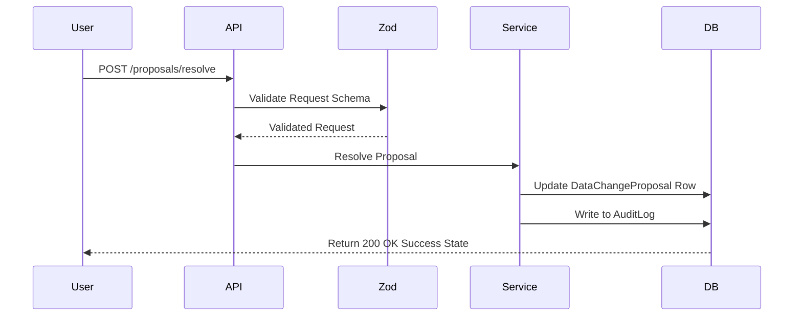

# API Architecture: SettleUp Endpoints

This document maps out all RESTful API routes provided by the SettleUp backend server. Every endpoint is built as a Next.js API Route with TypeScript typings, schema validation using Zod, and NextAuth session enforcement.

---

## 1. Authentication Endpoints

### Post login credentials
- **Route**: `POST /api/auth/callback/credentials`
- **Method**: `POST`
- **Authorization**: None (Public)
- **Request Validation (Zod)**:
  ```json
  {
    "username": "string (min 2, max 50)",
    "password": "string (min 4)"
  }
  ```
- **Response (200 OK)**:
  ```json
  {
    "user": {
      "id": "uuid-string",
      "name": "Aisha",
      "role": "MEMBER"
    },
    "redirect": "/dashboard"
  }
  ```

---

## 2. Group & Membership Endpoints

### List user groups
- **Route**: `GET /api/groups`
- **Method**: `GET`
- **Authorization**: Authenticated Session Required
- **Response (200 OK)**:
  ```json
  [
    {
      "id": "uuid-group-1",
      "name": "Spreetail Flatmates",
      "memberCount": 6,
      "createdAt": "2026-02-01T00:00:00Z"
    }
  ]
  ```

### Get group details
- **Route**: `GET /api/groups/[id]`
- **Method**: `GET`
- **Authorization**: Authenticated Session (User must be a member or guest)
- **Response (200 OK)**:
  ```json
  {
    "id": "uuid-group-1",
    "name": "Spreetail Flatmates",
    "members": [
      { "id": "u-1", "name": "Aisha", "role": "MEMBER" },
      { "id": "u-2", "name": "Rohan", "role": "MEMBER" },
      { "id": "u-7", "name": "Kabir", "role": "GUEST" }
    ],
    "membershipHistory": [
      { "userId": "u-4", "userName": "Meera", "event": "LEAVE", "date": "2026-03-29" },
      { "userId": "u-6", "userName": "Sam", "event": "JOIN", "date": "2026-04-08" }
    ]
  }
  ```

---

## 3. Expense & Settlement Endpoints

### Create new expense
- **Route**: `POST /api/expenses`
- **Method**: `POST`
- **Authorization**: Authenticated Session
- **Request Validation (Zod)**:
  ```json
  {
    "groupId": "uuid-string",
    "paidById": "uuid-string",
    "description": "string (1-100)",
    "originalAmount": "number",
    "originalCurrency": "string (INR | USD)",
    "date": "string (ISO Date)",
    "splitType": "string (equal | unequal | percentage | share)",
    "participants": [
      { "userId": "uuid-string", "shareValue": "number (optional)" }
    ],
    "notes": "string (optional)"
  }
  ```
- **Response (201 Created)**:
  ```json
  {
    "id": "uuid-expense-1",
    "description": "April Rent",
    "baseCurrencyAmount": 48000
  }
  ```

### Create settlement repayment
- **Route**: `POST /api/settlements`
- **Method**: `POST`
- **Authorization**: Authenticated Session
- **Request Validation (Zod)**:
  ```json
  {
    "groupId": "uuid-string",
    "senderId": "uuid-string",
    "receiverId": "uuid-string",
    "amount": "number",
    "currency": "string (INR | USD)",
    "date": "string (ISO Date)",
    "notes": "string (optional)"
  }
  ```
- **Response (201 Created)**:
  ```json
  {
    "id": "uuid-settlement-1",
    "sender": "Rohan",
    "receiver": "Aisha",
    "baseCurrencyAmount": 5000
  }
  ```

---

## 4. Balance & Explanation Endpoints

### Get group balances
- **Route**: `GET /api/groups/[id]/balances`
- **Method**: `GET`
- **Authorization**: Authenticated Session
- **Response (200 OK)**:
  ```json
  {
    "balances": [
      { "userId": "u-1", "name": "Aisha", "netBalance": 34500.50 }
    ],
    "suggestedSettlements": [
      { "from": "Rohan", "to": "Aisha", "amount": 12450.20 }
    ]
  }
  ```

### Get balance explanation drill-down
- **Route**: `GET /api/groups/[id]/balances/explain/[userId]`
- **Method**: `GET`
- **Authorization**: Authenticated Session
- **Response (200 OK)**:
  ```json
  {
    "userId": "u-2",
    "userName": "Rohan",
    "netBalance": -12450.20,
    "calculationSteps": [
      {
        "type": "EXPENSE_OWED",
        "description": "February rent",
        "amount": 12000,
        "date": "2026-02-01",
        "splitFraction": "1/4",
        "adjustedINR": -12000
      }
    ]
  }
  ```

---

## 5. Import System & DataChangeProposal Endpoints

### Upload CSV file
- **Route**: `POST /api/imports/upload`
- **Method**: `POST`
- **Authorization**: Authenticated Session
- **Request**: Multipart Form Data with file element `file`
- **Response (202 Accepted)**:
  ```json
  {
    "sessionId": "uuid-session-1",
    "fileName": "data.csv",
    "status": "PENDING_REVIEW",
    "totalRows": 42,
    "proposalCount": 15
  }
  ```

### List Change Proposals for Review
- **Route**: `GET /api/imports/sessions/[id]/proposals`
- **Method**: `GET`
- **Authorization**: Authenticated Session
- **Response (200 OK)**:
  ```json
  [
    {
      "id": "prop-uuid-1",
      "recordId": "rec-uuid-10",
      "rowNumber": 15,
      "field": "splitDetails",
      "originalValue": "Aisha 30%; Rohan 30%; Priya 30%; Meera 20%",
      "proposedValue": "Aisha 27.27%; Rohan 27.27%; Priya 27.27%; Meera 18.18%",
      "reason": "Percentages sum to 110% instead of 100%. Scaled down proportionally.",
      "status": "PENDING"
    },
    {
      "id": "prop-uuid-2",
      "rowNumber": 34,
      "field": "date",
      "originalValue": "04-05-2026",
      "proposedValue": "2026-04-05",
      "reason": "Date format is ambiguous. Chronologically suggests April 5, 2026.",
      "status": "PENDING"
    }
  ]
  ```

### Resolve proposal
- **Route**: `POST /api/imports/sessions/[id]/proposals/resolve`
- **Method**: `POST`
- **Authorization**: Authenticated Session
- **Request Validation (Zod)**:
  ```json
  {
    "proposalId": "uuid-string",
    "action": "string (APPROVE | REJECT | CUSTOM)",
    "customValue": "string (optional)"
  }
  ```
- **Response (200 OK)**:
  ```json
  {
    "proposalId": "prop-uuid-1",
    "status": "APPROVED",
    "resolvedValue": "Aisha 27.27%; Rohan 27.27%; Priya 27.27%; Meera 18.18%"
  }
  ```

### Commit import session
- **Route**: `POST /api/imports/sessions/[id]/commit`
- **Method**: `POST`
- **Authorization**: Authenticated Session
- **Response (200 OK)**:
  ```json
  {
    "sessionId": "uuid-session-1",
    "status": "COMPLETED",
    "rowsImported": 39,
    "rowsRejected": 3
  }
  ```

### Fetch import report
- **Route**: `GET /api/imports/sessions/[id]/report`
- **Method**: `GET`
- **Authorization**: Authenticated Session
- **Response (200 OK)**:
  ```json
  {
    "report": {
      "sessionId": "uuid-session-1",
      "date": "2026-06-13T13:19:07Z",
      "rowsRead": 42,
      "rowsImported": 39,
      "rowsRejected": 3,
      "resolutionsApplied": [
        { "row": 15, "field": "splitDetails", "original": "110%", "resolved": "100% rescaled", "decision": "APPROVED" }
      ]
    }
  }
  ```

---

## 6. Audit Log & Report PDF Endpoints

### Fetch audit trail
- **Route**: `GET /api/audit-logs`
- **Method**: `GET`
- **Authorization**: Authenticated Session
- **Response (200 OK)**:
  ```json
  {
    "logs": [
      {
        "id": "log-123",
        "action": "APPROVE_PROPOSAL",
        "details": { "proposalId": "prop-uuid-1", "field": "splitDetails", "resolved": "rescaled" },
        "timestamp": "2026-06-13T13:22:00Z"
      }
    ]
  }
  ```

### Download PDF Report
- **Route**: `GET /api/imports/sessions/[id]/report/pdf`
- **Method**: `GET`
- **Authorization**: Authenticated Session
- **Response**: Binary PDF Stream (`application/pdf`)

---

## 7. Responsibilities & Design Tradeoffs

### Endpoint Validation Tradeoff
- **Option 1: JSON validation in services**: Let services check types and raise runtime exceptions.
- **Option 2: Controller Schema validation (Chosen)**: We use Zod at the API routing border. Invalid payloads are blocked before hitting the database or services, reducing load on our business systems.
- **Tradeoff**: Adds route handler file lines, but ensures database input safety.

### Action / State Synchronization Diagram


*Rationale*: Structuring API handlers with Zod validation filters requests early, keeping services focused purely on business rules and database insertions.
