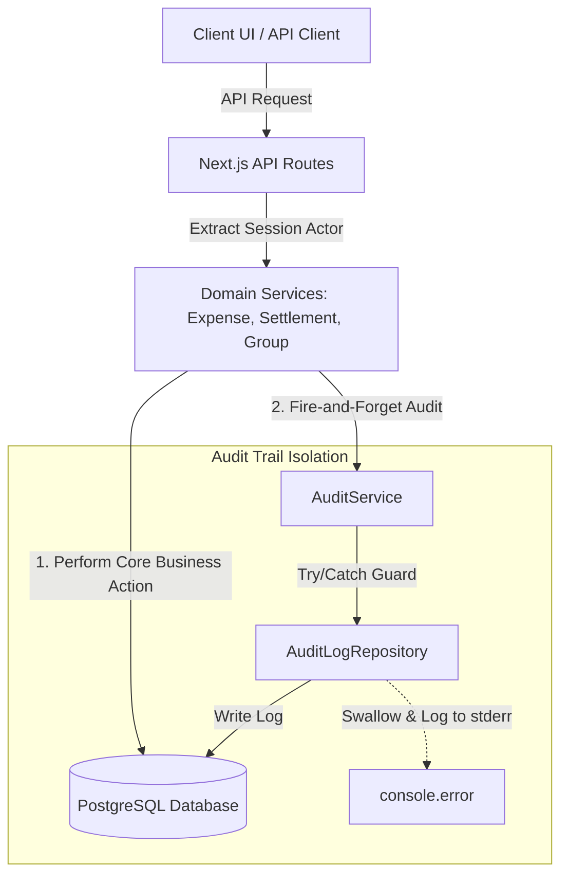
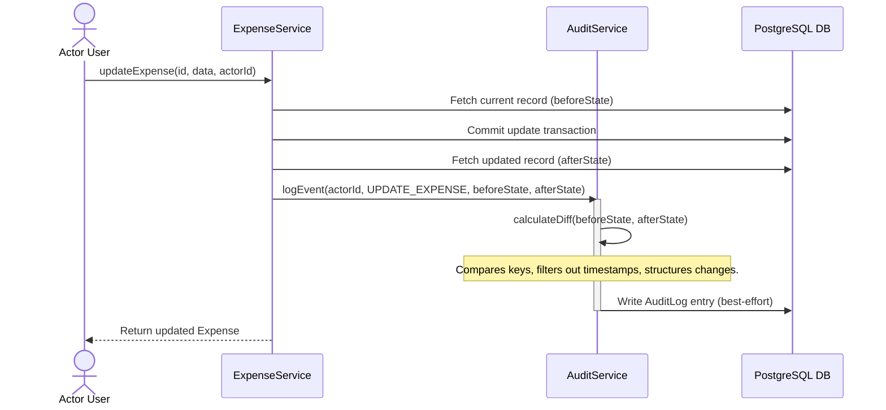

# SettleUp: Audit Trail Architecture Report

This report documents the architectural design, event flow, transaction guarantees, and testing summary of the centralized, best-effort Audit Trail system implemented for SettleUp.

---

## 1. Architecture Diagram

The SettleUp audit trail decouples core business logic from logging side-effects. All writes must route through `AuditService` to prevent direct or duplicate database writes.



---

## 2. Event Flow & Data Structure

### Audit Event Schema
Every record created in the `AuditLog` table contains:
- `id`: Unique UUID.
- `userId`: Actor user ID (null for system actions).
- `action`: `AuditActionType` enum (e.g. `CREATE_EXPENSE`, `UPDATE_SETTLEMENT`).
- `timestamp`: DateTime of creation.
- `entityType`: Target entity class name (e.g., `EXPENSE`, `SETTLEMENT`, `GROUP`, `MEMBERSHIP`).
- `entityId`: Unique identifier of the target record.
- `beforeState` / `afterState`: Full snapshots of the target entity before and after mutation.
- `changedFields`: Pre-calculated differences for update operations.
- `metadata`: JSON object containing supplemental query context.
- `correlationId`: Unique request tag grouping multiple related audit steps.
- `notes`: Human-readable comments.

### Event Flow (Diff Calculation for Updates)



---

## 3. Visual Diff Example (UPDATE_EXPENSE)
For any `UPDATE` action, the system compares the original and mutated snapshots. System fields (such as `createdAt`, `updatedAt`, and `deletedAt`) are filtered out to prevent noise in the history trail.

### Example Database Record
- **Action**: `UPDATE_EXPENSE`
- **Entity**: `EXPENSE` (`exp-abc-123`)
- **Before State**:
  ```json
  {
    "id": "exp-abc-123",
    "description": "February Rent",
    "originalAmount": "5000",
    "originalCurrency": "INR"
  }
  ```
- **After State**:
  ```json
  {
    "id": "exp-abc-123",
    "description": "Rent February (Adjusted)",
    "originalAmount": "5500",
    "originalCurrency": "INR"
  }
  ```
- **Calculated `changedFields`**:
  ```json
  {
    "description": { "before": "February Rent", "after": "Rent February (Adjusted)" },
    "originalAmount": { "before": "5000", "after": "5500" }
  }
  ```
*This `changedFields` JSON is parsed directly by the UI to render clean, side-by-side red/green diff comparisons.*

---

## 4. Key Design Decisions & Tradeoffs

### Centralized Service vs. Inline Logging
- **Decision**: Centralized via `AuditService`.
- **Tradeoff**: Inline database writes are simple to implement initially but lead to duplicate parsing logic and tightly couple domain transactions to logging schema. Centralizing logging in `AuditService` ensures all logs conform to a strict layout and isolates diffing calculations.

### Non-blocking Fail-Safe Auditing (Best-Effort)
- **Decision**: Wrap all logging database writes in `try/catch` blocks.
- **Tradeoff**: If the database is under heavy load or lock contention occurs on the `AuditLog` table, throwing an error would cause the user's payment settlement or expense checkout to fail. By swallowing log errors, writing them to a separate error channel (`stderr`), and returning `null`, we ensure core business functions always succeed, prioritizing system availability.

---

## 5. Testing Summary

Automated tests in [audit.test.ts](file:///Users/navjotkumarsingh/Desktop/SettleUp/src/tests/unit/audit.test.ts) verify the complete audit pipeline:
- **Diff Tracking**: Verifies that state comparisons are computed correctly and system timestamps are ignored.
- **Fault-Tolerance**: Confirms that logging database errors are caught, logged to stderr, and do not crash parent transactions.
- **Service Integrations**: Asserts that `CREATE`, `UPDATE`, and `DELETE` actions on `ExpenseService`, `SettlementService`, and `GroupService` trigger correct events.
- **Auth Log hooks**: Verifies callback hooks catch success, failure, and logout states.

All **57 tests** pass successfully.
