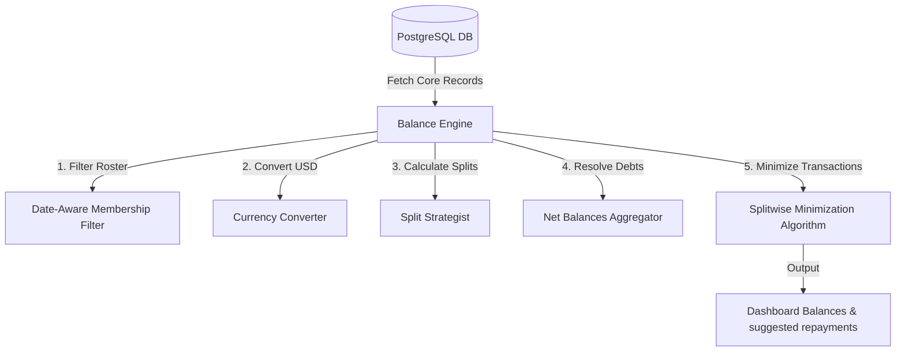

# Balance Engine Architecture: Financial Resolution Engine

This document details the mechanics, math, and logic of the SettleUp Balance Engine. This system processes expenses, splits, currency rates, and group memberships to calculate net balances and simplify transactions.

---

## 1. Core Architecture Diagram

---

## 2. Chronological Date-Aware Memberships

The engine uses membership logs to determine the active group roster for any expense date:
1. **Roster definition**: For any transaction date $D$, the active roster consists of users in `GroupMembership` where $D \ge \text{joinedAt}$ and $(D \le \text{leftAt} \text{ or } \text{leftAt is Null})$.
2. **Guest Exemption**: Guest Users (e.g. `Kabir`, with `role = "GUEST"`) bypass membership checks. They participate only in the specific transactions where they are explicitly named.
3. **CSV Timeline**:
   - **Meera** (left Sunday **2026-03-29**): Excluded from all calculations after March 29. Row 36 (dated 2026-04-02) is flagged as a membership violation.
   - **Sam** (joined **2026-04-08**): Excluded from all calculations before April 8.

---

## 3. Multi-Currency System

USD transactions (Goa trip) are converted to the base currency **INR** using transaction-date rates:
- **Conversion rate**: **1 USD = 83.50 INR** for March 2026 transactions.
- **Conversion formula**:
  $$\text{Amount (INR)} = \text{Original Amount} \times \text{Exchange Rate}$$

---

## 4. Split Strategy Calculations

The engine resolves splits into individual debtor shares:

### Equal Split (`equal`)
Cost is divided equally among all listed participants:
$$\text{OwedBy}_i = \frac{\text{Total Amount (INR)}}{N}$$
Where $N$ is the count of users in `split_with`.

### Unequal Split (`unequal`)
Amounts are read directly from `split_details`:
$$\text{OwedBy}_i = \text{Amount (INR) from details for participant } i$$
- *Validation Check*: $\sum \text{OwedBy}_i == \text{Total Expense Amount}$.

### Percentage Split (`percentage`)
Percentage shares are parsed and calculated:
$$\text{OwedBy}_i = \text{Total Amount (INR)} \times \frac{\text{Percentage}_i}{100}$$
- *DataChangeProposal Resolution*: If percentages sum to 110% (Rows 15 and 32), the engine uses the rescaled percentages approved by the user (e.g., divided by 1.1) to ensure the sum equals 100%.

### Share Split (`share`)
Calculated using ratios:
$$\text{OwedBy}_i = \text{Total Amount (INR)} \times \frac{\text{Share}_i}{\sum \text{Shares}}$$

---

## 5. Net Balance Formula

For each user $U$, the engine aggregates payments and debts to calculate a net balance:
$$\text{Net Balance}_U = \sum \text{AmountPaidBy}_U - \sum \text{AmountOwedBy}_U + \sum \text{RepaymentsReceived}_U - \sum \text{RepaymentsSent}_U$$

- $\text{Net Balance}_U > 0$: User is a **Creditor** (owed money from the group).
- $\text{Net Balance}_U < 0$: User is a **Debtor** (owes money to the group).

---

## 6. Minimum Transactions Algorithm (Splitwise)

To resolve balances with the fewest payments:
1. Divide users into two lists:
   - **Debtors**: Users with negative net balances.
   - **Creditors**: Users with positive net balances.
2. Sort both lists by absolute balance values in descending order.
3. Greedily match the top debtor $D$ and top creditor $C$:
   - Payment amount $A = \min(|Balance_D|, Balance_C)$.
   - Create a suggested transaction: **$D$ pays $C$ amount $A$**.
   - Update $Balance_D = Balance_D + A$.
   - Update $Balance_C = Balance_C - A$.
   - Remove any user whose balance is reduced to 0.
   - Repeat until all balances are zero.

---

## 7. Worked Examples

### Example A: Scooter Rentals (Row 22)
- **Original Data**: `10-03-2026, Scooter rentals, Priya, 3600, INR, share, Aisha;Rohan;Priya;Dev, Aisha 1; Rohan 2; Priya 1; Dev 2`
- **Total Amount**: 3600 INR.
- **Payer**: Priya (+3600 INR).
- **Roster & Shares**:
  - Total shares = $1 + 2 + 1 + 2 = 6$.
  - Aisha owes: $3600 \times 1/6 = 600$ INR
  - Rohan owes: $3600 \times 2/6 = 1200$ INR
  - Priya owes: $3600 \times 1/6 = 600$ INR
  - Dev owes: $3600 \times 2/6 = 1200$ INR
- **Net Balance Adjustments**:
  - Aisha: -600 INR
  - Rohan: -1200 INR
  - Priya: $+3600 - 600 = +3000$ INR
  - Dev: -1200 INR

### Example B: Parasailing (Row 23)
- **Original Data**: `11-03-2026, Parasailing, Dev, 150, USD, equal, Aisha;Rohan;Priya;Dev;Dev's friend Kabir`
- **Conversion**: $150 \text{ USD} \times 83.50 = 12,525 \text{ INR}$.
- **Payer**: Dev (+12,525 INR).
- **Roster**: Kabir is a transient guest. Split is equal among the 5 participants.
  - Share per person = $12525 / 5 = 2505$ INR.
- **Net Balance Adjustments**:
  - Aisha: -2505 INR
  - Rohan: -2505 INR
  - Priya: -2505 INR
  - Dev: $+12525 - 2505 = +10,020$ INR
  - Kabir (Guest): -2505 INR

### Example C: Direct Settlement (Row 14)
- **Original Data**: `25-02-2026, Rohan paid Aisha back, Rohan, 5000, INR,, Aisha`
- **Payer**: Rohan.
- **Recipient**: Aisha.
- **Split**: None. Stored directly as a Settlement.
- **Net Balance Adjustments**:
  - Rohan (Sender): +5000 INR
  - Aisha (Receiver): -5000 INR

---

## 8. Responsibilities & Design Tradeoffs

- **Responsibilities**:
  - `balance-engine.ts`: Calculates user net balances and runs transaction minimization.
  - `membership.ts`: Checks dates against active group roster memberships.
- **Tradeoffs**:
  - *Alternative: Run minimization on all transactions history*: Calculating balances from scratch is slow but accurate.
  - *Chosen: Chronological aggregation*: We query transactions from DB, rebuild rosters chronologically, and aggregate. This ensures that historical balance lookups remain correct.
  - *Tradeoff*: Slows down calculation for long transaction histories. We mitigate this by saving snapshots in the `BalanceSnapshot` table.
