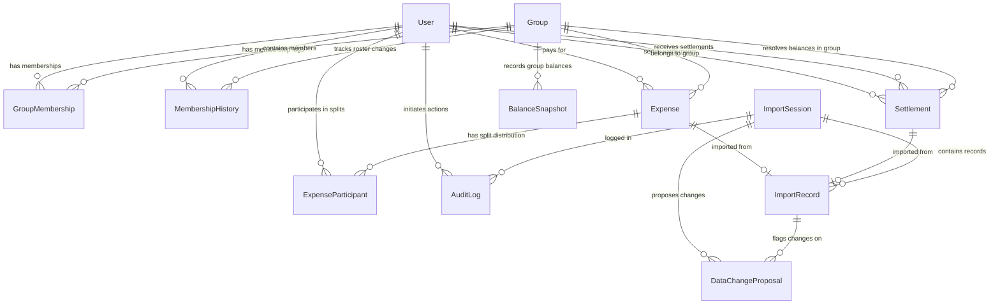

# Database Architecture: SettleUp Relational Schema

This document details the normalized relational database schema designed for SettleUp. The design is structured to eliminate data redundancy, enforce referential integrity, support audits, and ensure data changes are audited via the `DataChangeProposal` workflow.

---

## 1. Entity-Relationship (ER) Diagram

---

## 2. Table Schemas & Rationales

### 1. `User` Table
- **Purpose**: Stores information for all users (standard members and guest users).
- **Rationale**: Single table storage with a `role` field (`"MEMBER"`, `"GUEST"`) avoids polymorphic foreign key relationships, making database queries simpler and index lookups faster.

### 2. `Group` Table
- **Purpose**: Represents a shared expense group.
- **Rationale**: normalizes transaction boundaries. Even if the current CSV is a single group, group division allows scaling the database to support multiple groups.

### 3. `GroupMembership` & `MembershipHistory` Tables
- **Purpose**: Track active memberships and history logs of membership events.
- **Rationale**: Isolating current state from historical changes simplifies lookup queries while preserving a date-aware record of membership roster events.

### 4. `Expense` & `ExpenseParticipant` Tables
- **Purpose**: Store expense records and split allocations.
- **Rationale**: We store original details alongside base calculations. A composite unique index on `[expenseId, userId]` in the participant table prevents duplicate split records.

### 5. `Settlement` Table
- **Purpose**: Records debt repayment transactions between users.
- **Rationale**: Repayments are treated as separate entities from expenses. This prevents split algorithms from being applied to repayments, simplifying balance calculations.

### 6. `ImportSession` & `ImportRecord` Tables
- **Purpose**: Manage staging of CSV imports.
- **Rationale**: Staging parsed rows in a temporary table keeps uncommitted data separate from final expense ledgers, protecting transaction history.

### 7. `DataChangeProposal` Table
- **Purpose**: Tracks proposed normalization changes, duplicate resolutions, and date corrections.
- **Columns**:
  - `id` (UUID, Primary Key)
  - `sessionId` (UUID, Foreign Key -> `ImportSession.id`, Cascade Delete)
  - `recordId` (UUID, Nullable, Foreign Key -> `ImportRecord.id`, Cascade Delete)
  - `rowNumber` (Int)
  - `field` (String): E.g. `"date"`, `"paid_by"`, `"amount"`, `"currency"`, `"split_details"`.
  - `originalValue` (String/JSON): Original raw parsed string.
  - `proposedValue` (String/JSON): Target value proposed by parsing rules.
  - `reason` (String): Reason explaining why this change was proposed.
  - `status` (String): `"PENDING"`, `"APPROVED"`, or `"REJECTED"`.
  - `resolvedValue` (String/JSON, Nullable): Final value approved by the user.
- **Rationale**: Implements the generic `DataChangeProposal` workflow. Surfacing all changes (merges, deletes, date fixes, etc.) in a review queue ensures data changes require explicit user approval (Meera's rule).

### 8. `AuditLog` & `BalanceSnapshot` Tables
- **Purpose**: System audit logs and historical balance records.
- **Rationale**: Provides change tracking and performance optimization for balance feeds.

---

## 3. Cardinality Explanations

- **`ImportSession` to `DataChangeProposal` ($1:\text{N}$)**: A session can generate multiple change proposals. Deleting a session deletes all related proposals.
- **`ImportRecord` to `DataChangeProposal` ($1:\text{N}$)**: A single row can trigger multiple proposals (e.g., Row 15 triggers a name normalization and a percentage rescaled split detail change).

---

## 4. Tradeoffs & DB Alternatives

### Alternative: JSON fields vs. Explicit Relational Split Tables
- **JSON splits**: Storing participant shares in a JSON column within the `Expense` table reduces schema complexity.
- **Relational Split Table (Chosen)**: We use `ExpenseParticipant`. While it increases query joins, it allows database-level validation (e.g., foreign keys, unique constraint indexes) and index-based querying.
- **Tradeoff**: Marginally slower inserts, but enforces strict data integrity.

### Alternative: Dynamic Rates Table vs. Static API conversions
- **Static API**: Fetching currency rates on demand saves storage space.
- **Effective Date rates table (Chosen)**: Storing rates in `ExchangeRate` enables historical lookups, ensuring balance calculations remain stable.
- **Tradeoff**: Requires database storage, but ensures reproducible audits.
