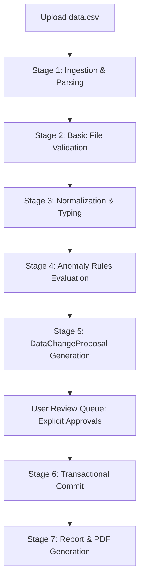
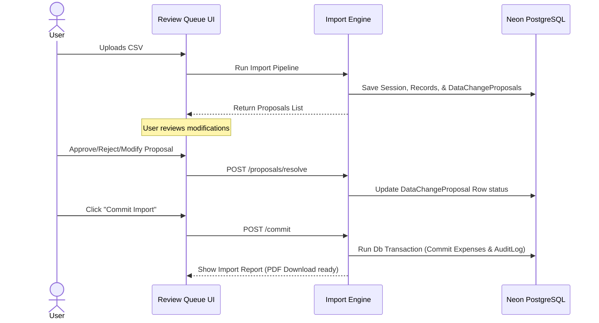

# Import Engine Architecture: Multi-Stage CSV Pipeline

This document explains the architecture and operational phases of the SettleUp Import Engine. The pipeline parses, cleanses, flags, and audits financial transactions imported from raw CSV files.

---

## Data Flow Diagram

---

## The 7 Import Stages & Data Governance

To satisfy the **Data Governance Rule** (Meera's rule), the import engine does not auto-modify or silently change data. Instead, any normalization, date resolution, currency inference, percentage adjustment, or duplicate merge is staged as a `DataChangeProposal` which requires explicit user approval.

### Stage 1: Ingestion & Parsing
- **Process**: Reads the raw CSV file. Splits fields by commas while handling quotes and multi-line fields.
- **Output**: Generates an `ImportSession` (`status = "PENDING_REVIEW"`) and maps CSV rows to database `ImportRecord` entities.

### Stage 2: Basic File Validation
- **Process**: Checks that headers match (`date,description,paid_by,amount,currency,split_type,split_with,split_details,notes`). Verifies row formatting.
- **Tradeoff**: If header columns fail structure matching, the session status is immediately set to `"REJECTED"`, stopping further execution.

### Stage 3: Normalization & Typing
The parser reads inputs and proposes corrections, creating `DataChangeProposal` records for:
- **Payer Names**: Maps casing or variations (e.g., `"priya"` -> `"Priya"`, `"Priya S"` -> `"Priya"`, `"rohan "` -> `"Rohan"`).
- **Date String**: Converts inconsistent/short formats (e.g., `"Mar-14"` -> `"2026-03-14"`). Flags ambiguous inputs like `"04-05-2026"` for manual selection between April 5 and May 4.
- **Split Details**: Normalizes percentages (e.g., scaling 110% splits in Rows 15 and 32 to 100%).
- **Currencies**: Infers missing currencies (e.g., Row 28 defaults to `"INR"`).

### Stage 4: Anomaly Rules Evaluation
Rules evaluate the relationships across rows:
1. **Potential Duplicates**: Flags rows with matching dates, payers, and amounts (e.g. Rows 5 & 6). Proposes merging or deleting.
2. **Conflicting duplicates**: Identifies identical events with different payers or values (e.g. Rows 24 & 25 Thalassa dinner). Proposes choosing one.
3. **Membership Violations**: Detects participants added before they joined (e.g. Sam) or after they left (e.g. Meera). Proposes reassigning participants.

### Stage 5: Review Queue (Unified Proposals Hub)
Proposals are saved to the database. The UI blocks transaction commits until all `PENDING` proposals are resolved:
- For every proposal, the UI displays:
  1. The original CSV value.
  2. The proposed normalized value.
  3. The reason for the change.
- The user must click **Approve** (accepting proposal), **Reject** (rejecting row import), or **Custom** (inputting manual overrides).

### Stage 6: Transactional Commit
Once proposals are resolved, the user clicks "Commit Import". The engine executes a single database transaction:
1. Applies approved proposals to create `Expense`, `ExpenseParticipant`, and `Settlement` records.
2. Writes resolution decisions to the `AuditLog`.
3. Sets the `ImportSession` status to `"COMPLETED"`.

### Stage 7: Import Report & PDF Generation
- Compiles metrics (rows read, imported, rejected) and tables of all resolved proposals.
- Renders a downloadable PDF summary utilizing `pdf-lib`.

---

## Import Execution Sequence Diagram

---

## Technical Responsibilities & Tradeoffs

- **Stage Isolation (Responsibility)**: The parser only stages data. It has no write access to core tables (`Expense`, `Settlement`). This ensures no unreviewed changes impact balances.
- **Staging Table Tradeoff**:
  - *Alternative*: Keeping uncommitted files in a file cache or memory session.
  - *Chosen*: Database staging table. This keeps uncommitted data accessible if the user reloads the page or loses connection.
  - *Tradeoff*: Increases database write operations during uploads, but prevents data loss.

---

## Dry Run Import Mode (Phase 5 Requirement Preview)
To support auditing and verification prior to committing files, the import engine will support a **Dry Run Import Mode**. 

### Capabilities:
1. **Parse CSV**: Full processing of raw rows.
2. **Detect anomalies**: Run all Stage 3 and Stage 4 validator checks (e.g. duplicate check, membership dates boundary check, split percentage totals check).
3. **Generate DataChangeProposals**: Stage all modifications in database staging tables.
4. **Generate Import Report Preview**: Summarize metrics (total parsed, total anomalies, total proposed changes).
5. **Generate Balance Impact Preview**: Dynamically query `BalanceEngineService` to calculate and output a mock preview of net balance changes for all group users if the import were to be committed, **WITHOUT** writing any actual records to production tables (`Expense`, `ExpenseParticipant`, `Settlement`).

