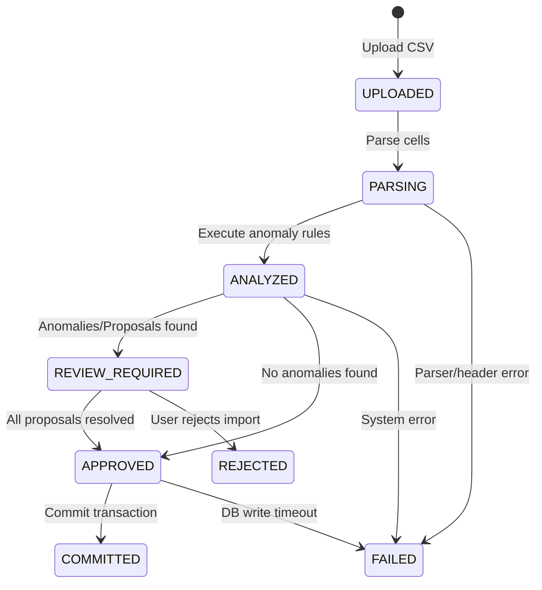

# Import Session State Machine

This document defines the lifecycle states and transition rules for an `ImportSession`.

---

## State Diagram



---

## States Definition

- **`UPLOADED`**: The file has been successfully uploaded and staged in database memory.
- **`PARSING`**: The parser is splitting raw cells and creating `ImportRecord` entities.
- **`ANALYZED`**: The `AnomalyDetectorEngine` has finished running all rule checks.
- **`REVIEW_REQUIRED`**: Anomalies or proposals are pending review. The session is locked in this state.
- **`APPROVED`**: All anomalies have been reviewed, and all proposals have been resolved (`APPROVED`/`REJECTED`).
- **`REJECTED`**: The user has cancelled the import. Staged records will not be committed.
- **`COMMITTED`**: Staged transactions have been successfully written to `Expense` and `Settlement` tables.
- **`FAILED`**: A parsing error, validation integrity failure, or commit error occurred.

---

## Transition Validation Logic

Status transitions are governed by strict verification rules in the service layer:

```typescript
export function validateStateTransition(
  current: ImportSessionStatus,
  target: ImportSessionStatus
): boolean {
  const allowedTransitions: Record<ImportSessionStatus, ImportSessionStatus[]> = {
    UPLOADED: ['PARSING', 'FAILED'],
    PARSING: ['ANALYZED', 'FAILED'],
    ANALYZED: ['REVIEW_REQUIRED', 'APPROVED', 'FAILED'],
    REVIEW_REQUIRED: ['APPROVED', 'REJECTED', 'FAILED'],
    APPROVED: ['COMMITTED', 'FAILED'],
    REJECTED: [],
    COMMITTED: [],
    FAILED: [],
  };

  return allowedTransitions[current]?.includes(target) ?? false;
}
```
If a transition is requested that violates these routes, the service throws an `InvalidStateTransition` error, protecting database state from out-of-order execution.
