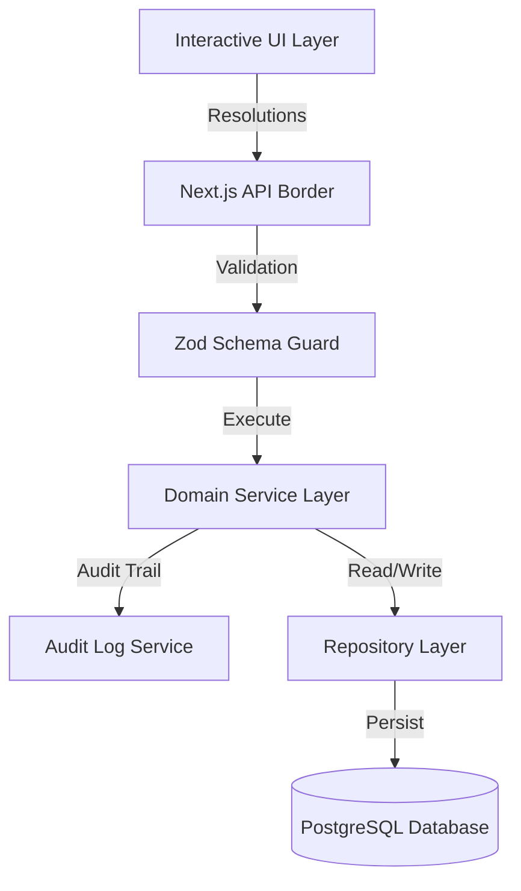

# Technical Defense Guide: SettleUp Architecture

This guide provides technical rationale, design justifications, and answers to common interview questions to support the SettleUp codebase.

---

## 1. Core Architecture Diagram

*Rationale*: By using a multi-layered design (UI -> API -> Service -> Repository -> Database), the application isolates data governance, business rules, and data storage. This separation of concerns ensures that the codebase remains testable and maintainable.

---

## 2. Database Schema & Rationale

### Q: Why is the `User` table structured with a `role` field rather than separate tables for Guests and Members?
- **Defense**: Separate tables would require polymorphic relationships across the `Expense` and `Settlement` tables, complicating queries. A single table with a `role` field (`"MEMBER"`, `"GUEST"`) keeps foreign keys simple. Roster-based rules (e.g. date-aware membership checks) are handled in the service layer, keeping database indexing simple and fast.

### Q: Why do you have separate `ImportAnomaly` and `DataChangeProposal` tables?
- **Defense**: They serve different purposes. `ImportAnomaly` is an automated log of detected errors (e.g., duplicate rows). `DataChangeProposal` represents the proposed fix (e.g., merge, date correction) that requires explicit user approval. This separation keeps the warning ledger distinct from the change requests queue.

---

## 3. Authentication & NextAuth

### Q: Why did you use NextAuth with a Credentials Provider?
- **Defense**: Credentials authentication allows us to manage mock users (Aisha, Rohan, Priya, Meera, Dev, Sam, and Kabir) with local hashed passwords. The `authorize` callback compares the submitted password against the bcrypt hash in the database. NextAuth handles session management using JSON Web Tokens (JWT), keeping credentials secure.

### Q: How is authorization enforced for roles like Guest?
- **Defense**: NextAuth includes the user's role in both the JWT token and the session object (`Session.user.role`). Middleware protects pages like `/dashboard`, and service-layer validation checks the user's role before executing actions (e.g., guests are excluded from permanent memberships).

---

## 4. Membership & Date-Aware Calculations

### Q: How do you check if a member was active on an expense date?
- **Defense**: We query `GroupMembership` to find the user's membership intervals (`joinedAt` to `leftAt`). If the expense date falls within these boundaries, the split is valid. Guest users bypass these checks and are only included if explicitly listed in the transaction. No dates are hardcoded in the codebase; all boundary checks query database tables dynamically.

---

## 5. Test Suite Mocks

### Q: How do you test authentication without connecting to PostgreSQL?
- **Defense**: We mock the database client (`prisma`) directly in Vitest. The test file mocks the `findUnique` query to return a mock user profile with a pre-computed bcrypt password hash, allowing us to assert that `authorize` succeeds or fails in isolation.

---

## 6. Financial Domain: Split Strategy, Currencies, and Settlements

### Q: Why did you use the Strategy Pattern for split calculations instead of a switch statement?
- **Defense**: Switch statements in calculations lead to bloated helper classes and violate the Single Responsibility Principle. By separating calculations into distinct strategy classes (`EqualSplitStrategy`, `ExactSplitStrategy`, `PercentageSplitStrategy`, `SharesSplitStrategy`) adhering to a single `SplitStrategy` interface, we decouple each split algorithm's logic. If new split types are required in the future, we simply add a class without risk of breaking existing tested calculations (complying with the Open/Closed Principle).

### Q: How do you address floating-point errors and rounding anomalies in splits?
- **Defense**: Javascript's native `number` representation (IEEE 754 double precision) suffers from rounding bugs (e.g. `0.1 + 0.2 === 0.30000000000000004`). We eliminate this by performing all splits and conversions using the `decimal.js` library, initialized with a high precision limit (20). In splits (like `EQUAL`), we calculate exact fractions and allocate the remaining pennies (reconciled down to the cent) to the first participant, ensuring that the sum of the splits is always mathematically equal to the total transaction amount.

### Q: How does the currency system ensure conversions are reproducible?
- **Defense**: Real-time currency APIs can return varying rates and introduce network latency. To guarantee reproducibility, we store exchange rates in a dedicated `ExchangeRate` table with effective timestamps. The service looks up the closest historical rate available on or before the transaction date. Additionally, we store the original amount, original currency, selected exchange rate, and the final converted INR amount directly on the `Expense` or `Settlement` records. This ensures that the math is fully deterministic, audit-ready, and independent of external APIs.

### Q: What guards are placed on the Settlement creation route?
- **Defense**: First, Zod validates the parameters. Second, the service validates that the sender and receiver are not the same user (preventing self-settlement). Third, it queries the dynamic membership boundaries to ensure both users are active group members or guests on the transaction date. Finally, it uses the database-driven historical rate lookup to calculate the exact converted INR value, enforcing financial data integrity.

---

## 7. Audit Trail Architecture & Centralized Logging

### Q: Why did you implement a centralized AuditService rather than logging inline?
- **Defense**: Inline logging violates the Separation of Concerns and leads to copy-pasted diffing logic. Centralizing logging in `AuditService` ensures all logs conform to a structured schema (Actor ID, Action Type, Timestamp, Entity Type/ID, snapshots, metadata, and Correlation ID). It also guarantees that diff tracking (evaluating changes in `beforeState` and `afterState`) is performed consistently across all entities.

### Q: How do you prevent audit log failures from bringing down core business transactions?
- **Defense**: The Audit system is designed to be **best-effort and non-blocking**. In the `AuditService` methods, database writes are wrapped in `try/catch` blocks. If the database connection drops or a write conflict occurs on the audit table, the error is caught and printed to a separate error channel (`console.error`), and `null` is returned, letting the core business action (like checking out an expense or confirming a settlement) succeed. Auditing should never be a single point of failure for core operations.

### Q: How is the state difference (diff) tracked and structured in UPDATE events?
- **Defense**: When an update occurs, the caller service fetches the existing entity as `beforeState` and records the resolved entity as `afterState`. `AuditService` compares these state snapshots dynamically, ignoring system fields (like auto-updating timestamps `createdAt`, `updatedAt`, `deletedAt`). It maps the exact modified keys into a `changedFields` JSON object matching `{ field: { before, after } }`. This allows the UI to render clean side-by-side visual diffs and provides an exact audit ledger of what was modified.

---

## 8. Balance Engine, Debt Simplification, & Snapshots

### Q: Why is the BalanceEngineService established as the Single Source of Truth?
- **Defense**: Allowing individual modules like `ExpenseService`, `SettlementService`, or `DebtSimplificationService` to perform independent balance math would introduce inconsistencies, code duplication, and bugs. In our architecture, the `BalanceEngineService` is the *only* component that calculates user balances. Every other service and API route queries it to ensure unified calculations.

### Q: Explain the Debt Simplification algorithm and its computational complexity.
- **Defense**: To minimize the number of transactions required to settle up, we use a **Greedy Net-Balance Matching Algorithm**. Creditors (positive balances) and Debtors (negative balances) are sorted. We match the largest creditor with the largest debtor and perform a transfer of `min(creditor_amount, |debtor_amount|)`. This reduces at least one user's balance to 0, and we repeat. Sorting $N$ users takes $O(N \log N)$. The greedy matching loop runs at most $N-1$ times, each loop taking $O(1)$ operations with pointers. The total time complexity is $O(N \log N)$, which is highly efficient.

### Q: Why do we use Snapshot Versioning for caching group balances?
- **Defense**: Computing balances from scratch on every page load would require sequential table scans across all expenses and settlements ($O(E + S)$), which degrades performance. Cache snapshotting reduces this to $O(1)$ database reads. We use **Snapshot Versioning** rather than in-place deletion to prevent read/write locks and concurrency errors. Historical versions are never deleted, and a new version is created and set to `isCurrent = true` atomically inside a transaction.

### Q: What database indices optimize the balance queries?
- **Defense**: We declared composite B-Tree indices on the `BalanceSnapshot` table covering `(groupId, isCurrent, version)`. This allows Next.js API routes to fetch the current active snapshot using index seeks ($O(\log K)$) rather than scanning the table ($O(K)$). We also indexed the foreign keys `groupId` and `userId` on the `Expense`, `ExpenseParticipant`, and `Settlement` tables to speed up database reads.

---

## 9. Import Engine & State Machine

### Q: Why did you implement a Plugin Architecture for Anomaly Rules?
- **Defense**: Modularity and OCP. In a monolithic validator, adding checks (e.g. PercentageSum, UnknownUser) requires modifying core methods, increasing the risk of regression. With our `AnomalyRule` interface and context dispatcher, each rule is a self-contained plugin class. Rules are registered dynamically in `AnomalyDetectorEngine`, making unit-testing and adding new rules trivial.

### Q: Why do you compute record fingerprints rather than mapping row numbers?
- **Defense**: Stability and identity. Row numbers are transient; if a user removes a row or overrides a record, row numbers shift, breaking previously stored anomaly associations. By hashing `date + payer + amount + description` using SHA-256, we get a unique, deterministic fingerprint for each record. This fingerprint survives file editing, row removals, and session restarts, enabling stable, indexed duplicate checks.

### Q: How does the import dry run prevent data pollution?
- **Defense**: The `ImportDryRunService` runs in a transaction context that writes exclusively to staged tables (`ImportSession`, `ImportRecord`, `ImportAnomaly`, and `DataChangeProposal`). No records are written to production tables (`Expense`, `Settlement`, or `BalanceSnapshot`). We simulate projected balance impacts dynamically using a mapped preview array, validating zero-sum integrity before committing.

### Q: Explain the Import Session State Machine and transition rules.
- **Defense**: To prevent data corruption, sessions follow a strict transition path: `UPLOADED` $\rightarrow$ `PARSING` $\rightarrow$ `ANALYZED` $\rightarrow$ `REVIEW_REQUIRED` (if anomalies are found) $\rightarrow$ `APPROVED` (once proposals are resolved) $\rightarrow$ `COMMITTED` (bulk transaction save). Valid transitions are validated by service-layer guards, blocking out-of-order calls and ensuring data governance.
