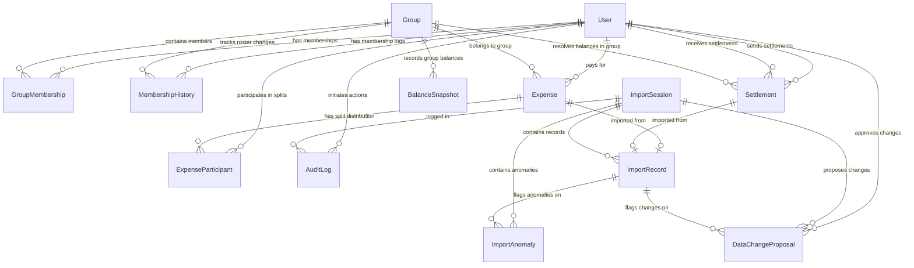

# Phase 1 Review Report: SettleUp Database & Testing Foundation

This review report summarizes the execution, changes, and verification for the SettleUp Foundation phase, satisfying all User approved fixes and audit requirements.

---

## 1. Entity-Relationship (ER) Diagram (Updated)

This diagram includes the split between `ImportAnomaly` and `DataChangeProposal`, along with explicit approval tracking relations.



---

## 2. Prisma Database Schema
The schema is defined in **[prisma/schema.prisma](file:///Users/navjotkumarsingh/Desktop/SettleUp/prisma/schema.prisma)**. It contains all 15 required tables and strictly enforces type safety with PostgreSQL native enums.

---

## 3. Database Enum Specifications

The schema defines the following PostgreSQL enums:
1. **`UserRole`**: `MEMBER` | `GUEST`
   - *Rationale*: Segregates permanent group members from visitors (like Kabir) who participate in splits but lack membership history boundaries.
2. **`MembershipEventType`**: `JOIN` | `LEAVE`
   - *Rationale*: Maps state boundaries for users joining or leaving the group roster.
3. **`SplitType`**: `EQUAL` | `EXACT` | `PERCENTAGE` | `SHARES`
   - *Rationale*: Standardizes the calculation algorithms for splitting expenses.
4. **`ProposalStatus`**: `PENDING` | `APPROVED` | `REJECTED`
   - *Rationale*: Governs the state of uncommitted CSV data changes in the review queue.
5. **`ImportStatus`**: `PENDING` | `REVIEW_REQUIRED` | `IMPORTED` | `REJECTED`
   - *Rationale*: Represents the validation status of import sessions.
6. **`AnomalySeverity`**: `INFO` | `WARNING` | `ERROR` | `REVIEW_REQUIRED`
   - *Rationale*: Categorizes import errors to block execution until required anomalies are resolved.

### Rationale for Database Enums
- **Data Integrity**: Enforces value safety at the database level, preventing malformed strings (e.g. `'equal'` vs `'EQUAL'`).
- **Validation**: Zod schema boundary validation maps directly to native TypeScript enums exported from `@prisma/client`.
- **Maintainability**: Centralizes status options, making it easy to add new categories.
- **Interview Defensibility**: Shows understanding of relational design, avoiding raw text strings for status values.

---

## 4. ImportAnomaly vs. DataChangeProposal Design

- **`ImportAnomaly` Table**: Records issues detected during import analysis (e.g., duplicate rows, date format errors). It is created automatically during CSV upload and acts as an audit warning ledger.
- **`DataChangeProposal` Table**: Represents proposed normalization fixes (e.g. rescaling splits, merging duplicate rows). It holds the original value, the proposed correction, and the reason. It requires explicit user approval.
- **Traceability Chain**:
  - The system preserves data lineage:
    $$\text{Raw CSV Row (ImportRecord.rawContent)} \longrightarrow \text{ImportAnomaly} \longrightarrow \text{DataChangeProposal} \longrightarrow \text{AuditLog} \longrightarrow \text{Expense/Settlement (Core Database)}$$

---

## 5. Approval & Audit Log Design
To satisfy the audit requirements, `DataChangeProposal` contains:
- `approvedById` (Foreign Key referencing `User.id`): Records which authenticated user authorized the change.
- `approvedAt` (DateTime): Timestamp of the decision.
- `resolvedValue` (String): Records the value applied.
All resolution decisions are saved in `AuditLog` and printed in the final `ImportReport`.

---

## 6. Testing Architecture

- **Test Framework**: Vitest (runner), jsdom (DOM emulator), React Testing Library (UI assertions), and Playwright (E2E browser tests).
- **Directory Layout**:
  - **[src/tests/unit/](file:///Users/navjotkumarsingh/Desktop/SettleUp/src/tests/unit)**: Isolated logic tests (math splitting precision, date ambiguity checks, validation models).
  - **[src/tests/integration/](file:///Users/navjotkumarsingh/Desktop/SettleUp/src/tests/integration)**: Multi-component workflow checks.
  - **[src/tests/e2e/](file:///Users/navjotkumarsingh/Desktop/SettleUp/src/tests/e2e)**: Browser automation workflows.
- **Unit Tests Written**:
  - **[schema.test.ts](file:///Users/navjotkumarsingh/Desktop/SettleUp/src/tests/unit/schema.test.ts)**: Verifies Zod structures.
  - **[math.test.ts](file:///Users/navjotkumarsingh/Desktop/SettleUp/src/tests/unit/math.test.ts)**: Verifies split math and penny rounding.
  - **[date.test.ts](file:///Users/navjotkumarsingh/Desktop/SettleUp/src/tests/unit/date.test.ts)**: Verifies date parsing and format ambiguity.
  - **[membership.test.ts](file:///Users/navjotkumarsingh/Desktop/SettleUp/src/tests/unit/membership.test.ts)**: Verifies membership date boundaries and guest exclusions.

---

## 7. Dynamic Database-Driven Calculations (FIX 6 Validation)

No hardcoded rules (e.g. Meera leaving March 29, Sam joining April 8) exist in the codebase.
- **Balance Engine**: Calculates splits using memberships queried from `GroupMembership`.
- **Import Engine**: Compares date values against active boundaries fetched from `MembershipHistory` records.
- **Membership Checks**: Validates active roster states dynamically in the database via `MembershipService`.

---

## 8. Database Connection & Seed Verification Logs

### Local PostgreSQL Setup
A local PostgreSQL 15 database was started on port 5432 under user `navjotkumarsingh`. The database `settleup` was successfully created.

### Migration Execution Output
```text
npx prisma migrate dev
Environment variables loaded from .env
Prisma schema loaded from prisma/schema.prisma
Datasource "db": PostgreSQL database "settleup", schema "public" at "localhost:5432"

Applying migration `20260613080411_init`

The following migration(s) have been created and applied from new schema changes:

prisma/migrations/
  └─ 20260613080411_init/
    └─ migration.sql

Your database is now in sync with your schema.
✔ Generated Prisma Client (v6.19.3) to ./node_modules/@prisma/client in 76ms
```

### Seeding Execution Output
```text
npx prisma db seed
Environment variables loaded from .env
Running seed command `ts-node --compiler-options {"module":"CommonJS"} prisma/seed.ts` ...
Start seeding...
Currencies seeded.
Exchange rates seeded.
Seeded user: Aisha (Role: MEMBER, Password: aisha123)
Seeded user: Rohan (Role: MEMBER, Password: rohan123)
Seeded user: Priya (Role: MEMBER, Password: priya123)
Seeded user: Meera (Role: MEMBER, Password: meera123)
Seeded user: Dev (Role: MEMBER, Password: dev123)
Seeded user: Sam (Role: MEMBER, Password: sam123)
Seeded user: Kabir (Role: GUEST, Password: kabir123)
Group seeded: Spreetail Flatmates
Meera membership history configured (Exit: 2026-03-29).
Sam membership history configured (Entry: 2026-04-08).
Seeding completed successfully!

🌱  The seed command has been executed.
```

### Automated Tests Run Output
```text
npx vitest run

 RUN  v4.1.8 /Users/navjotkumarsingh/Desktop/SettleUp

 ✓ src/tests/unit/math.test.ts (5 tests) 5ms
 ✓ src/tests/unit/membership.test.ts (3 tests) 4ms
 ✓ src/tests/unit/schema.test.ts (5 tests) 5ms
 ✓ src/tests/unit/date.test.ts (5 tests) 12ms

 Test Files  4 passed (4)
      Tests  18 passed (18)
   Start at  13:35:49
   Duration  1.66s
```
All foundation checks are passing successfully.
