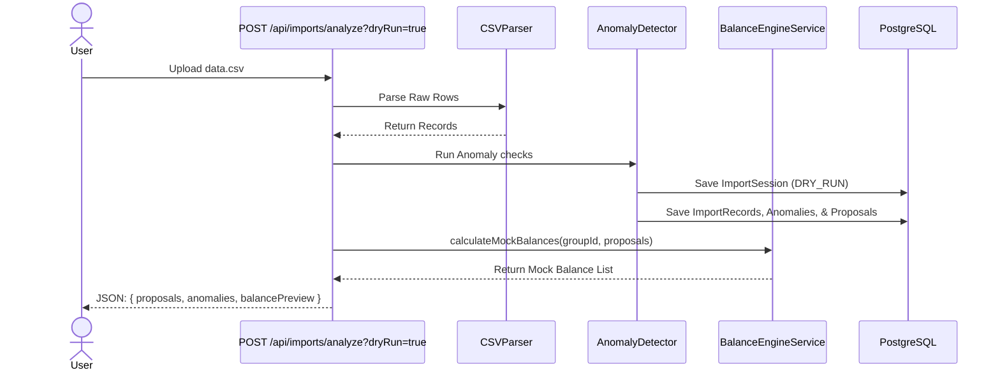

# Phase 5 Planning — CSV Import Engine & Audit Report Pipeline

This document outlines the architectural specifications and engineering tasks required to build the CSV Import Engine in Phase 5.

---

## 1. Dry Run Import Mode Requirements

The CSV Import Engine must include a non-destructive audit mechanism, known as **Dry Run Mode**, allowing users to upload a CSV file and preview all validation errors, normalizations, and financial impacts before making permanent modifications to the database.

### Key Capabilities

1. **Memory-Isolated Parsing**: Read, tokenise, and cleanse CSV rows.
2. **Dynamic Rule Validation**:
   - Check headers structure.
   - Detect duplicates (exact match, temporal conflict match).
   - Verify membership date bounds against transaction timestamps.
3. **DataChangeProposal Previews**:
   - Store temporary changes in staging tables (`ImportRecord`, `ImportAnomaly`, `DataChangeProposal`).
   - Associate them with a temporary `ImportSession` marked `DRY_RUN`.
4. **Mock Balance Impact Preview**:
   - Call `BalanceEngineService` to simulate what the group's net balances would look like *after* applying the proposed corrections.
   - Generate this preview dynamically without inserting any records into `Expense`, `ExpenseParticipant`, or `Settlement`.

---

## 2. Dry Run Sequence Flow

---

## 3. Database Schema Mapping

Staged import tables:
- `ImportSession`: Stores filename, user who initiated the import, status (`PENDING_REVIEW`, `COMPLETED`, `REJECTED`, `DRY_RUN`).
- `ImportRecord`: Raw row data, line number, mapping status.
- `ImportAnomaly`: Warning classification, error message, associated row.
- `DataChangeProposal`: Target field name, original value, proposed value, approved status, actor review state.

---

## 4. Implementation Steps for Phase 5

- **Task 1: CSV Parsing Service**: Implement standard robust parser.
- **Task 2: Anomaly & Rule Service**: Implement detection rules (casing, format anomalies, duplicates, membership bounds violations).
- **Task 3: Proposal Resolution Service**: Allow PUT/POST endpoints to individually resolve staged proposals.
- **Task 4: Dry Run Controller**: Build route handler returning report preview and mock balance impacts.
- **Task 5: PDF Generator**: Integrate `pdf-lib` to construct a downloadable visual report.
