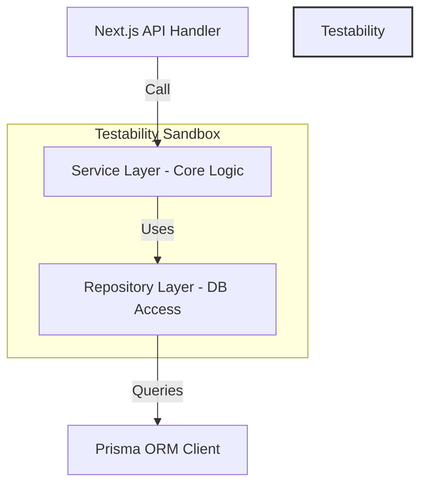

# Project Structure: SettleUp Shared Expenses Platform

This document describes the complete directory structure and design architecture for the SettleUp codebase. The design prioritizes modularity, testability, separation of concerns, and strict data governance (the `DataChangeProposal` workflow).

---

## 1. Complete Folder Structure

```text
SettleUp/
├── prisma/
│   ├── schema.prisma             # Database schema configuration
│   └── seed.ts                   # Initial data seeder (Users, Rates, Base Currencies)
├── src/
│   ├── app/                      # Next.js 15 App Router Directory
│   │   ├── layout.tsx            # Global layout wrapping providers (Session, Toast, Theme)
│   │   ├── page.tsx              # Root landing page (redirects to Login or Dashboard)
│   │   ├── login/                # Interactive authentication portal & quick login picker
│   │   │   └── page.tsx
│   │   ├── dashboard/            # High-level metrics, summary graphs, recent activity
│   │   │   └── page.tsx
│   │   ├── groups/               # Groups views
│   │   │   ├── page.tsx          # Group list
│   │   │   └── [id]/             # Dynamic route for group details
│   │   │       ├── page.tsx      # Main details (Expenses Feed, Settlements Feed)
│   │   │       ├── members/      # Group members list & history log
│   │   │       ├── balances/     # Net balances view & split minimization chart
│   │   │       └── import/       # Import dashboard & historical reports list
│   │   ├── import/               # Multi-stage import pages
│   │   │   ├── page.tsx          # Upload dashboard
│   │   │   └── review/[id]/      # Review Queue UI for resolving session proposals
│   │   ├── audit-logs/           # Global historical action viewer
│   │   │   └── page.tsx
│   │   ├── settings/             # System config (Exchange Rates management)
│   │   │   └── page.tsx
│   │   └── api/                  # Next.js API Routes (Backend Endpoints)
│   │       ├── auth/             # NextAuth authentication config routes
│   │       ├── groups/           # Groups CRUD & details endpoints
│   │       ├── expenses/         # Expenses CRUD, splits, details endpoints
│   │       ├── settlements/      # Settlements CRUD endpoints
│   │       ├── balances/         # Balance calculations endpoints
│   │       ├── imports/          # CSV upload, proposal resolution, commit endpoints
│   │       └── audit-logs/       # Audit trail fetch endpoints
│   ├── components/               # UI Component Tree
│   │   ├── ui/                   # Shadcn UI primitives (Radix-wrapped styles)
│   │   │   ├── button.tsx
│   │   │   ├── dialog.tsx
│   │   │   ├── select.tsx
│   │   │   ├── table.tsx
│   │   │   ├── card.tsx
│   │   │   └── alert.tsx
│   │   ├── import/               # Specialized Import UI components
│   │   │   ├── FileUpload.tsx    # Drag-and-drop file upload target
│   │   │   ├── ProposalCard.tsx  # Shows original vs proposed value, diffs, and action buttons
│   │   │   └── ReviewQueue.tsx   # Aggregations, pagination, and bulk resolve controls
│   │   ├── balance/              # Specialized Balance UI components
│   │   │   ├── MinTransactions.tsx # Who pays whom card
│   │   │   └── ExplainerCard.tsx # Clickable balance explanation step-by-step drill down
│   │   └── layout/               # Shared template elements
│   │       ├── Navbar.tsx
│   │       ├── Sidebar.tsx
│   │       └── Footer.tsx
│   ├── services/                 # Core Business Logic Layer (Framework-Independent)
│   │   ├── import-engine.ts      # CSV parsing, checking, and DataChangeProposal generation
│   │   ├── balance-engine.ts     # Net balances calculation, minimization algorithm
│   │   ├── currency.ts           # Currency conversions and exchange rates logic
│   │   ├── membership.ts         # Date-aware membership checker
│   │   └── audit.ts              # Log tracking and audit trail writer
│   ├── repositories/             # Database Access Layer (Data mapping and queries)
│   │   ├── user.repo.ts          # Encapsulates Prisma User queries
│   │   ├── group.repo.ts         # Encapsulates Group and Membership queries
│   │   ├── expense.repo.ts       # Encapsulates Expense and split insertions
│   │   ├── settlement.repo.ts    # Encapsulates Settlement insertions
│   │   └── audit.repo.ts         # Encapsulates AuditLog inserts and lookups
│   ├── utils/                    # Common helper utilities
│   │   ├── date.ts               # Date string parser and ambiguity checker
│   │   └── math.ts               # Numeric and floating point safe decimals math
│   └── types/                    # Domain Type Declarations and Zod schemas
│       └── index.ts
├── tests/                        # Automated testing suite
│   ├── unit/                     # Business logic tests
│   │   ├── import-engine.test.ts
│   │   ├── balance-engine.test.ts
│   │   ├── currency.test.ts
│   │   └── date.test.ts
│   ├── integration/              # Combined workflows
│   │   └── import-pipeline.test.ts
│   └── setup.ts                  # Test framework initializers
├── public/                       # Static assets (images, icons)
├── package.json                  # NPM manifest (scripts and versions)
├── tsconfig.json                 # TypeScript compiler configuration
├── tailwind.config.ts            # Tailwind styling setup
└── README.md                     # Initial codebase setup and instructions
```

---

## 2. Responsibilities of Core Layers

| Folder / Layer | Responsibility |
|---|---|
| **`src/app/api/`** | Implements HTTP endpoint routes, processes URL parameters, validates payloads with Zod, checks user sessions, and delegates logic execution to Services. |
| **`src/services/`** | Contains pure business logic. Handles operations like parsing CSVs, identifying data discrepancies, formatting `DataChangeProposals`, computing date-aware group balances, and simplifying debt structures. |
| **`src/repositories/`** | Isolates database persistence logic. Maps queries to database indexes and translates raw relational results into domain types, preventing leak of ORM code into services. |
| **`src/components/`** | Provides reusable UI. `ProposalCard.tsx` renders structural diffs of data changes before/after and buttons to select resolution paths. |

---

## 3. Tradeoffs & Architectural Alternatives

### Alternative: Inline Controllers vs. Repository Pattern
- **Inline Controllers**: Placing database logic inside Next.js API Routes is fast to implement and requires fewer files.
- **Repository Pattern (Chosen)**: Separating queries into classes like `expense.repo.ts` keeps API routes simple. This makes unit testing mockable without requiring active PostgreSQL database runs.
- **Tradeoff**: Increases file count and introduces some boilerplate code, but is necessary for enterprise quality.

### Alternative: Ad-hoc State in Session Memory vs. Persistent Stage Database Table
- **Session Memory**: Storing CSV parsing results in user-session memory avoids database writes for uncommitted data.
- **Persistent Stage Database (Chosen)**: We store uncommitted CSV rows in `ImportRecord` and proposals in `DataChangeProposal` tables. This permits users to close the browser, share review queues, and protects audits from memory clearing.
- **Tradeoff**: Increases write operations during upload, but satisfies data governance (Meera's rule).

---

## 4. Architectural Justification Diagram



*Rationale*: Isolating logic in the `Service` layer allows test frameworks to run unit tests on the Balance and Import Engines. Database queries can be mocked using mock Repositories, ensuring code correctness.
