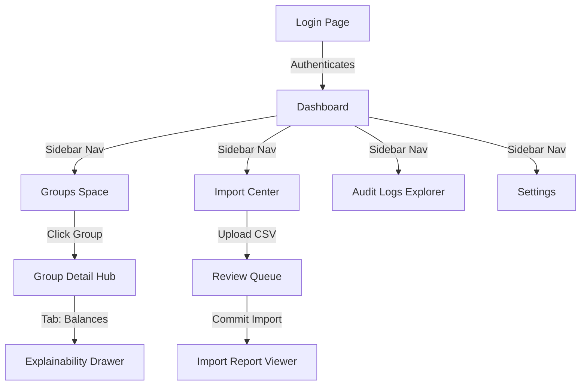

# UI Screen Map: User Interface Architecture

This document describes the page hierarchy, components, actions, and user flows for the SettleUp user interface. The UI uses Shadcn UI, Tailwind CSS, and Next.js page layouts to present complex financial data clearly.

---

## 1. UI Navigation Flow

---

## 2. Page Specifications & Layouts

### 1. Login Page
- **Purpose**: Authenticates users and offers developer bypasses for testing.
- **Key Components**:
  - `CredentialsForm`: Username and password fields.
  - `QuickLoginCard`: Quick login picker. Lists seeded users (Aisha, Rohan, Priya, Meera, Dev, Sam, and Kabir) in a visual grid to allow one-click login in development mode.
- **Actions**:
  - `Submit`: Authenticates credentials via NextAuth.
  - `Quick Login`: Impersonates selected user and logs them in.
- **Navigation Flow**: Redirects to the Dashboard on successful authentication.

### 2. Dashboard
- **Purpose**: High-level personal summary page showing net status and tasks.
- **Key Components**:
  - `MetricCards`: Displays personal net balance (owed vs owing) and pending import reviews.
  - `RecentActivityFeed`: Chronological display of recent expenses and actions.
  - `BalancesSummaryChart`: Bar chart showing relative balances.
- **Actions**:
  - `Click Quick-Action`: Navigate directly to group details or import review page.
- **Navigation Flow**: Links to Groups, Import Center, and Audit Logs.

### 3. Groups (List & Detail Hub)
- **Purpose**: Manage group context, expenses, and rosters.
- **Key Components**:
  - `GroupsGrid`: Displays active groups.
  - `GroupNavigationTabs`: Tab controls to toggle between Expenses, Balances, Members, and Imports.
  - `ExpenseDialog`: Pop-up form to log new expenses.
- **Actions**:
  - `Create Group`: Initialize a new group.
  - `Log Expense`: Open manual expense builder.
- **Navigation Flow**: Sub-navigation links within `/groups/[id]/*` to detailed sub-views.

### 4. Group Details: Members Roster
- **Purpose**: View current members, history, and add new users.
- **Key Components**:
  - `RosterTable`: Lists users and roles (`"MEMBER"` or `"GUEST"`).
  - `MembershipTimeline`: Vertical timeline showing move-in and move-out events (e.g. Meera leaving Sunday March 29, 2026).
- **Actions**:
  - `Add Member`: Open dialog to invite or seed user.
  - `Deactivate Membership`: Move-out action recording event date.

### 5. Group Details: Expense Feed & Detail Modal
- **Purpose**: Chronological log of group expenses and settlements.
- **Key Components**:
  - `ExpenseTable`: Columns for Date, Description, Paid By, Amount, Currency, and Splits.
  - `ExpenseDetailModal`: Displays split shares, converted amounts, notes, and import source details.
- **Actions**:
  - `View Details`: Open detail modal.
  - `Add Repayment`: Open settlement transaction drawer.

### 6. Group Details: Balances & Simplification Center
- **Purpose**: Resolve debts and view calculations.
- **Key Components**:
  - `NetBalancesGrid`: List of net user balances with visual indicators.
  - `MinTransactionsCard`: Lists minimized settlement payments ("A owes B amount").
  - `ExplainabilityDrilldown`: Expandable drawer showing the step-by-step calculations for a user's balance.
- **Actions**:
  - `Click Balance Row`: Open explainability drill-down.
  - `Record Repayment`: Auto-fills repayment form for selected debt.

### 7. Import Center (Upload & History)
- **Purpose**: Dashboard to upload files and view past logs.
- **Key Components**:
  - `UploadDropzone`: Ingestion target for `data.csv`.
  - `SessionHistoryTable`: List of sessions with statuses (`PENDING_REVIEW`, `COMPLETED`, `REJECTED`).
- **Actions**:
  - `Upload File`: Triggers parsed stream.
  - `View Report`: Open report viewer for completed sessions.

### 8. Import Review Queue
- **Purpose**: Interactive workspace to resolve import proposals before execution (Meera's rule).
- **Key Components**:
  - `ProposalCard`: A visual card showing the proposal details:
    - **Before/After Panel**: Shows the original CSV value side-by-side with the proposed value.
    - **Modification Reason**: Text label displaying why the change was proposed (e.g. rescaled percentage, inferred currency).
    - **Resolution Selector**: Action buttons to Approve the change, Reject the row import, or edit manually.
  - `DateAmbiguityResolver`: Dropdown picker for ambiguous dates (e.g., choice between April 5 and May 4 for `04-05-2026`).
- **Actions**:
  - `Approve Proposal`: Sets state of proposal to `APPROVED`.
  - `Reject Proposal`: Sets state of proposal to `REJECTED`, which will ignore/delete the row during execution.
  - `Commit Import`: Appears once all proposals are resolved. Triggers transactional execution in the database.

### 9. Import Report Viewer
- **Purpose**: Review results of executed import sessions.
- **Key Components**:
  - `SummaryCards`: Stats on imported vs rejected rows.
  - `ResolutionsLog`: List of all `DataChangeProposals` resolved.
- **Actions**:
  - `Export PDF`: Triggers client-side PDF download.

### 10. Audit Logs Explorer
- **Purpose**: View all changes made in the system.
- **Key Components**:
  - `AuditLogTable`: Filterable logs showing User, Action, Timestamp, and Details JSON.

---

## 3. UI Responsibilities & Design Tradeoffs

- **Responsibilities**:
  - `ReviewQueue.tsx` aggregates all change proposals.
  - `ProposalCard.tsx` manages resolution status and renders the original vs proposed values.
- **Tradeoffs**:
  - *Alternative: Direct cell editing in a grid sheet*: Letting users edit fields directly in a grid spreadsheet saves page clicks.
  - *Chosen: Before/After Proposal cards (Chosen)*: Using card-based selectors prevents accidental changes. This ensures every data modification requires explicit validation and approval.
  - *Tradeoff*: Requires more user clicks, but satisfies strict data governance rules (Meera's rule).
